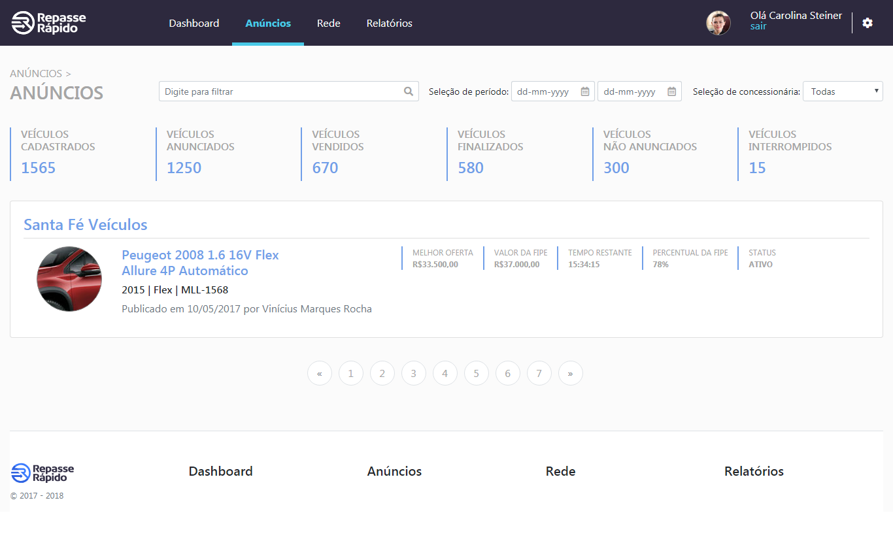

# RepasseApp

Este projeto foi gerado com [Angular CLI] (https://github.com/angular/angular-cli) versão 6.0.8.

## Tecnologias

- Angular 6;
- Bootstrap 4;
- Font icon Awesome 5;
- CSS 3;
- Html 5.

## Telas

## Servidor de desenvolvimento

Execute `ng serve` para um servidor dev. Navegue até `http: // localhost: 4200 /`. O aplicativo será recarregado automaticamente se você alterar qualquer um dos arquivos de origem.

## Build

Execute `ng build` para fazer o build do projeto. Os artefatos de construção serão armazenados no diretório `dist /`. Use a flaf `--prod` para um build de produção.

## Testes unitários

Execute `ng test` para executar os testes unitários via [Karma] (https://karma-runner.github.io).

## Testes end-to-end

Execute `ng e2e` para executar os testes de ponta a ponta via [Protractor] (http://www.protractortest.org/).

## Ajuda adicional

Para obter mais ajuda sobre o Angular CLI, use `ng help` ou vá conferir o [Angular CLI README] (https://github.com/angular/angular-cli/blob/master/README.md).
